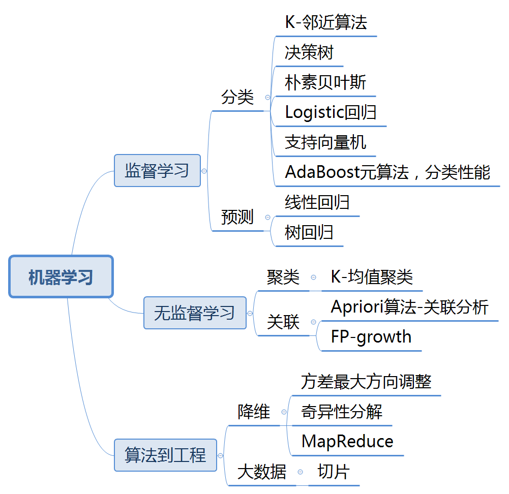

## 入门机器学习

- KNN算法

  添加相亲网站预测类型的分类案例
  
  添加0-9数字识别
  
  总结：
  
  k-近邻算法是分类数据最简单的最有效的算法；
  
  但是，执行效率不高，每个测试向量都得做距离运算，每个距离计算需要包含矩阵N维度的浮点运算，而且还要为测试数据准备额外的存储空间；
  这样的算法存储空间大，计算时间开销大;
  
  另一个缺陷是它无法给出任何数据的基础结构信息，因此无法也无法知晓平均实例样本和典型实例样本具有什么特征

- 决策树
  
  使用熵确定最优方案划分数据集，即用增益熵判断，用递归的方式构建树
  
  缺陷是在样本中需要明确知道所属**分类**
  

- 朴素贝叶斯算法
  
  添加文本分类算法案例
  
  添加识别垃圾邮件
  
  总结：
  
  朴素贝叶斯概率模型是通过特征之间的条件独立性的假设,尽管这个建设并不正确，但是任然是有效的分类器；
  可能，存在下溢或者上溢的风险，需要有做些优化.

- Logistic回归算法

  **一个判断优化算法的优劣的可靠方法是看它是否收敛，也就是说参数是否达到稳定值**
  
  Logistic回归的目的是找一个非线性函数Sigmoid的最佳拟合参数，求解过程可以有最优化算法来完成。在最优化算法中，最常用的是
  梯度上升算法，而梯度上升算法可以简化为随机梯度上升算法。使用或者占用更少的计算机资源，也可以在新数据集来时更新参数.
  
  优化：
  
  通过量化回归的效果，需要观测错误率，根据错误率决定是否回退到训练阶段，通过`迭代的次数`和`步长`等参数更好的得到回归参数
  
  数据清洗:
  
  数据相当的昂贵，扔掉和重新获取是不可取的
  
  必须通过一些方式来解决：
  
  1.使用可用特征值的均值填补缺失值.
  
  2.使用特殊值 如-1.
  
  3.忽略有缺失值的样本.
  
  4.使用相似样本的均值填补缺失值.
  
  5.使用另外的机器学习算法预测缺失值
  
  
  添加预测病马死亡率案例
  